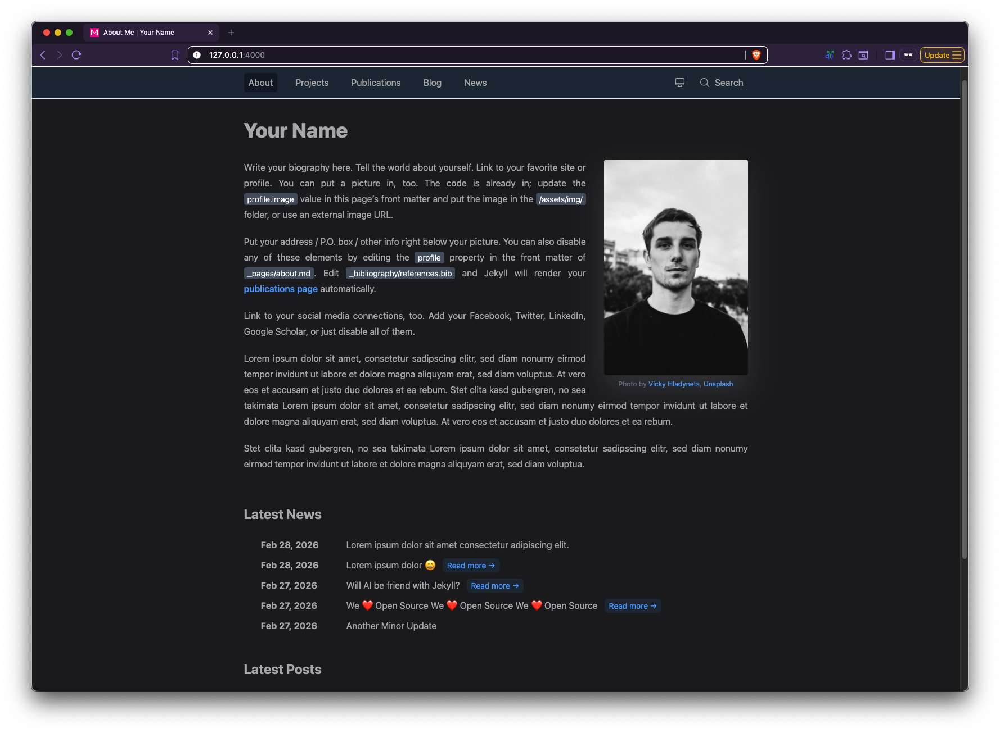

<p align="center">
  
</p>

<p align="center">
  <a href="https://rubygems.org/gems/jekyll-theme-merida"></a>
  <a href="https://rubygems.org/gems/jekyll-theme-merida"></a>
  <a href="LICENSE"></a>
  
  
</p>

<p align="center">
  A minimal, responsive Jekyll theme for personal, academic, and technical writing websites.
</p>

Merida ships with layouts for an about page, blog, news, projects, and publications, plus dark mode, MathJax, Rouge syntax highlighting, copy buttons for code blocks, Pagefind search, SEO metadata, RSS feeds, and sitemap generation.

<p align="center">
  
</p>

## Start Here

See [Installation](docs/installation.md) for startup paths, use cases, pros, cons, and setup commands.

## Features

- Responsive Tailwind CSS design with light, dark, and system theme modes.
- Blog and news collections with dedicated listing layouts.
- About page layout with optional profile image, latest posts, and latest news.
- Project list driven by `_data/repos.yaml`.
- Publication list driven by BibTeX and `jekyll-scholar`.
- Search modal powered by Pagefind after each Jekyll build.
- MathJax support for inline and display math.
- Rouge syntax highlighting with line numbers and copy buttons.
- SEO, sitemap, and feed support through standard Jekyll plugins.

## Requirements

- Ruby compatible with Jekyll 4.4.
- Bundler.
- Node.js and npm if you keep the starter's Pagefind hook or work on the theme source.
- Git for cloning the starter or theme source.

The theme depends on:

- `jekyll`
- `jekyll-feed`
- `jekyll-last-modified-at`
- `jekyll-scholar`
- `jekyll-seo-tag`
- `jekyll-sitemap`
- `rouge`
- `webrick`

## Documentation

- [Installation](docs/installation.md)
- [Configuration](docs/configuration.md)
- [Content Guide](docs/content.md)
- [Customization](docs/customization.md)
- [Search](docs/search.md)
- [Deployment](docs/deployment.md)
- [Development](docs/development.md)
- [Troubleshooting](docs/troubleshooting.md)

## Configuration Summary

Most site settings live in `_config.yml`:

```yaml
title: Your Name
tagline: A text-focused Jekyll theme
description: A minimal, responsive and feature-rich Jekyll theme for technical writing.
url: "https://example.com"
baseurl: ""
permalink: /blog/:slug/

footer:
  show_last_update: true
```

Navigation and footer links are data-driven:

- `_data/menu.yaml` controls the navigation bar.
- `_data/social.yaml` controls footer social links.
- `_data/repos.yaml` controls the projects page.

See [Configuration](docs/configuration.md) for every supported key and data shape.

## Creating Content

Create posts in `_posts`:

```markdown
---
layout: post
title: "My Post"
date: 2026-06-03 09:00:00 -0500
tags: [Jekyll, Writing]
---

Post content goes here.
```

Create news items in `_news`:

```markdown
---
layout: post
title: "New Release"
date: 2026-06-03
description: "Merida is ready for launch."
---

Optional long-form news body.
```

Add publications to `_bibliography/references.bib`. Merida renders entries through `jekyll-scholar` and `_layouts/bib.html`.

## Theme Development Commands

```sh
npm run dev          # Tailwind watch + Jekyll serve
npm run css:build    # Build minified assets/css/merida.css
npm run css:watch    # Rebuild CSS on changes
bundle exec jekyll build
```

## Contributing

See [CONTRIBUTING.md](CONTRIBUTING.md) for local setup, contribution guidelines, and pull request expectations.

## Support And Security

- For usage questions, see [SUPPORT.md](SUPPORT.md).
- For vulnerability reports, see [SECURITY.md](SECURITY.md).

## License

Merida is released under the MIT License. See [LICENSE](LICENSE).
